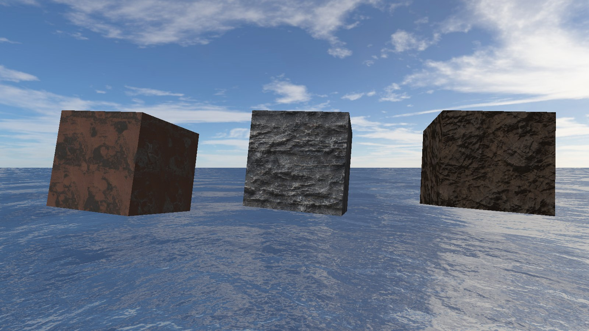

# Physically Based Rendering

This is an implementation of the PBR Intro Course by Maxime Garcia  
https://typhomnt.github.io/pbr_intro/

##### Table of Contents  
* [Install](#install)  
* [Usage](#usage)  
* [Results](#results)  
* [To go further](#to-go-further)

## Install

Install python with required packages
```console
sudo apt-get install python3 python3-pip libglfw3-dev
```

Install dependencies using `pip`
```console
pip3 install numpy PyOpenGL PyOpenGL-accelerate glfw
```

## Usage

Run the program
```console
python viewer.py
```

## Results

Here are the result with a light of *Intensity of 40* and (from left to right), metallic spheres with a roughness of *0.1, 0.3, 0.5, 0.7, 0.9 and 1.0*.


## To go further

**Physically Based Rendering** in raytracing is interesting, but our objects are homogenous, they don't have textures.

An usage of PBR is to render objects with a texture for each o the properties : *Albedo (Base Color), Normal, Roughness, Metalness and Ambient Occlusion*.

I decided to implement this technique in my [3D Sea Project](https://github.com/Eikins/3D-Sea-Project) in the same course.

I decided to use the same *Cook-Torrance BRDF*, and used both Maxime lecture and [Unreal Developper Brian Karis Comparison of BRDF](http://graphicrants.blogspot.com/2013/08/specular-brdf-reference.html) as reference.

The complete fragment shader code is available [here](media/pbr.v.glsl).  
The next step will be to implement indirect lighting using cubemap reflections.

I used textures from https://freepbr.com/.


