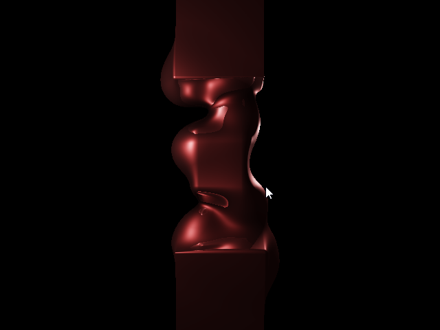
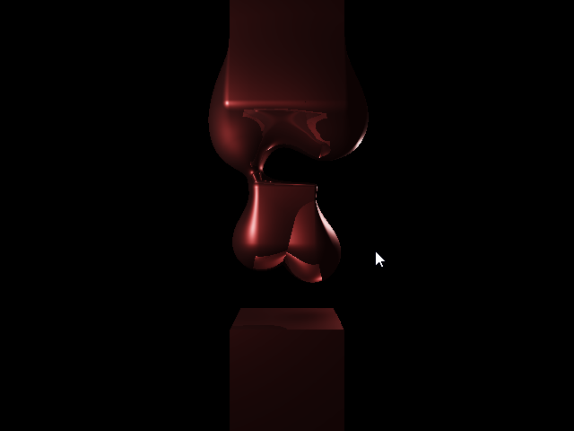
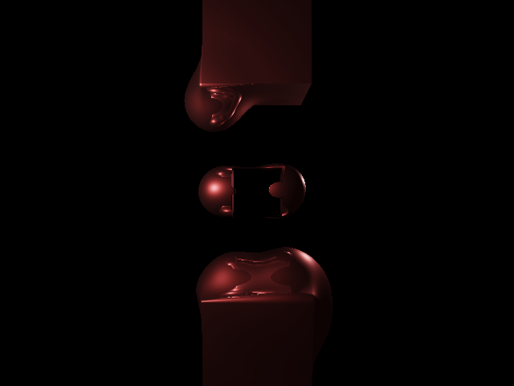

# Physically Based Rendering

This is an implementation of the PBR Intro Course by Maxime Garcia  
https://typhomnt.github.io/pbr_intro/

##### Table of Contents  
* [Install](#install)  
* [Usage](#usage)  
* [Results](#results)  
* [To go further](#to-go-further)

## Install

Install python with required packages
```console
sudo apt-get install python3 python3-pip libglfw3-dev
```

Install dependencies using `pip`
```console
pip3 install numpy PyOpenGL PyOpenGL-accelerate glfw
```

## Usage

Run the program
```console
python viewer.py
```

## Results

Results with blend operations:


Results with blend operations, and a union on the center right sphere:


Results with blend operations, and subtracting the center boxe:

