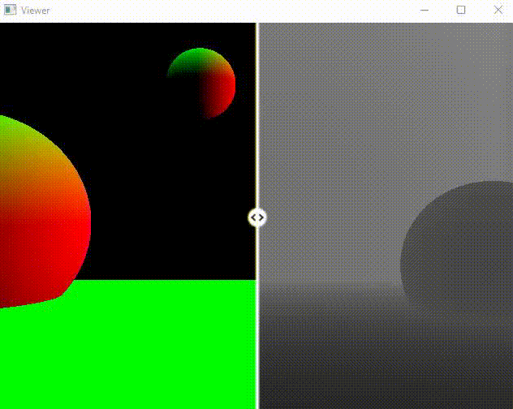
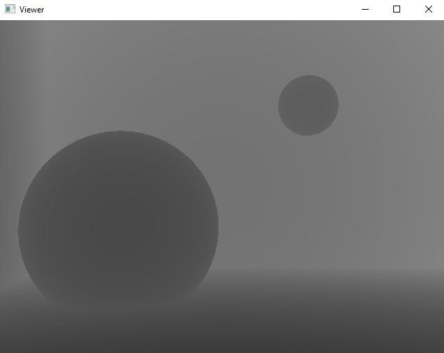
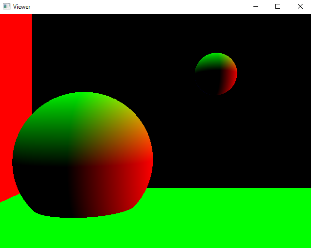
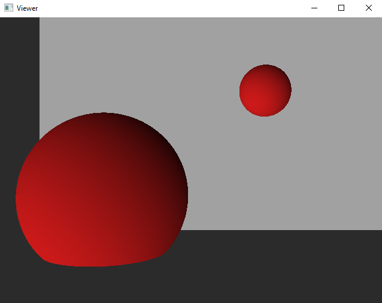
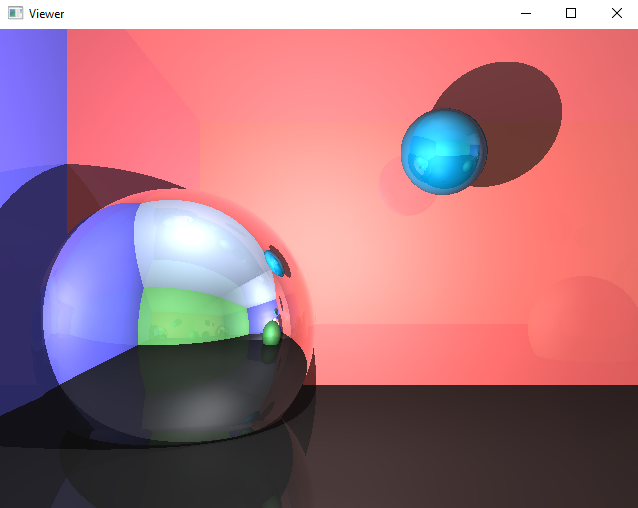
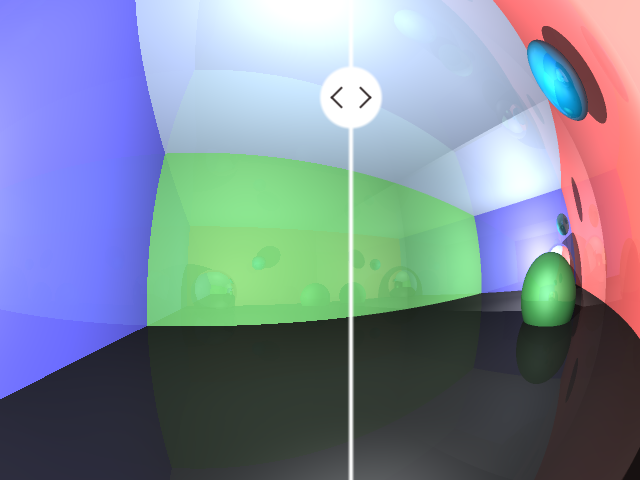

# Raytracing

## Practical Report

##### Table of Contents  
* [Install](#Install)  
* [Usage](#Usage)  
  * [Controls](#Controls)
* [Programs](#Programs)  
  * [Depth & Normals](#depth--normals)  
  * [Basic Shading](#basic-shading)
  * [Raytracing](#raytracing)

## Install

Install python with required packages
```console
sudo apt-get install python3 python3-pip libglfw3-dev
```

Install dependencies using `pip`
```console
pip3 install numpy PyOpenGL PyOpenGL-accelerate glfw
```

## Usage

Run the program
```console
python viewer.py
```

### Controls

Press `Space` to freeze the time.  
Press `Enter` to change the program.  
Use the `Mouse` to move the split bar.  


## Programs

### Depth & Normals

The first program uses the raycasting algorithm to generate the `Depth` and
`Normals` of the scene.

The `Normals` are rendered on the left side and the `Depth` on the right side.

#### Depth

#### Normals


### Basic Shading

The second program uses the raycasting algorithm and the `Normals` to simulate
a basic shading using the dot product.




### Raytracing

The third program uses the raytracing algorithm to render a scene.
The left side is rendered without anti-aliasing, whereas the right side uses a **2x SSAA** filter.

#### Without AA


#### With SSAA (2x)


#### Comparison

